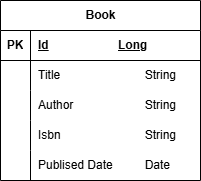

# Book Management System (Spring Boot)

A robust RESTful API built with Java 17/21 and Spring Boot to manage a book catalog. 
This project demonstrates clean architecture, DTO pattern, global exception handling, and PostgreSQL integration.

## Features

* **CRUD Operations:** Create, Read, Update, and Delete books.
* **Layered Architecture:** Clear separation between Controllers, Services, Entities, and Repositories.
* **Data Mapping:** Uses MapStruct for efficient Entity-to-DTO conversion.
* **Global Exception Handling:** Consistent error responses for resources not found or validation errors.
* **Database Integration:** Persistent storage using PostgreSQL.

---
## Project Structure

### The project follows a standard layered architecture for high maintainability:

* **controller:** Handles incoming HTTP requests.
* **service:** Contains business logic.
* **entity:** Database models.
* **dto:** Data Transfer Objects for secure data communication.
* **repository:** Data access layer.
* **mapper:** Object-to-object mapping logic.
* **error:** Global exception handlers and custom error responses.
---
## Prerequisites

Before running this project, ensure you have the following installed:
* **Java 21.0.7**
* **Maven 3.8.6**
* **PostgreSQL 18**

---
## Database Design (ER Diagram)

This project uses a relational database schema. Below is the Entity Relationship Diagram:



---

## Environment Variables & Configuration

The application requires a PostgreSQL database. You can configure the connection in `src/main/resources/application.yaml` or set the following Environment Variables on your system:

| Variable | Description | Default Value                                     |
| :--- | :--- |:--------------------------------------------------|
| `DB_URL` | JDBC Connection String | `jdbc:postgresql://localhost:5432/BookManagement` |
| `DB_USERNAME` | Database Username | `postgres`                                        |
| `DB_PASSWORD` | Database Password | `1234`                                            |

---

## How to Run the Project Locally

1.  **Clone the Repository:**
    ```bash
    git clone [https://github.com:trooulala/springboot-microservice-task-muhammad-sulthon-sayid-abdurrohman.git](https://github.com:trooulala/springboot-microservice-task-muhammad-sulthon-sayid-abdurrohman.git)
    cd git@github.com:trooulala/springboot-microservice-task-muhammad-sulthon-sayid-abdurrohman.git
    ```

2.  **Database Setup:**
    Open your PostgreSQL terminal or tool (like pgAdmin) and create the database:
    ```sql
    CREATE DATABASE BookManagement;
    ```

3.  **Build the Project:**
    ```bash
    mvn clean install
    ```

4.  **Run the Application:**
    ```bash
    mvn spring-boot:run
    ```
    The server will start at `http://localhost:8080`.

---

## 📮 API Endpoints & Postman Requests

### Book Endpoints

| Method     | Endpoint                | Description                |
|:-----------|:------------------------|:---------------------------|
| **GET**    | `/api/books`            | Retrieve all books         |
| **GET**    | `/api/books/{id}`       | Retrieve a book by ID      |
| **POST**   | `/api/books`            | Create a book              |
| **PUT**    | `/api/books/{id}`       | Update a book              |
| **PATCH**  | `/api/books/{id}/title` | Update only the book title |
| **DELETE** | `/api/books/{id}`       | Remove a book              |

### Sample JSON Request (Upsert Book)
```json
{
    "title": "Buku B",
    "author": "Author B",
    "isbn": "1235",
    "publishedDate": "2025-02-22"
}